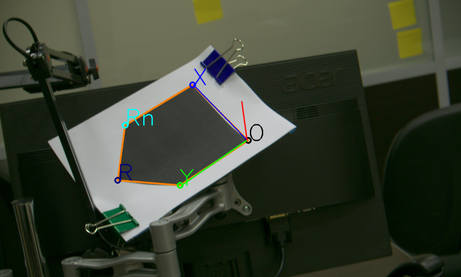

# Task
Application will receive as input:
* pattern - binary colored image (black-white)
* image in which app search pattern
* camera calibration settings relevant to the picture

Application will yield as output:
* patterns shift and rotation in camera coordinate system.

# Usage
```
$./tra_test_task --camera=tra_cv_test_assigment/camera.json --marker=tra_cv_test_assigment/object.svg --image=tra_cv_test_assigment/1.png 
```
## Output
```
2019-10-01 20:09:25,077 INFO [default] image is: tra_cv_test_assigment/1.png
2019-10-01 20:09:25,077 INFO [default] camera is: tra_cv_test_assigment/camera.json
2019-10-01 20:09:25,077 INFO [default] marker is: tra_cv_test_assigment/object.svg
2019-10-01 20:09:25,744 INFO [default] ROTATION MATRIX: 
[2.164463482569678;
 -0.8642195386775817;
 0.387907598269059]
2019-10-01 20:09:25,744 INFO [default] TRANSLATION MATRIX: 
[-442.9830558655922;
 -158.7325953973769;
 1880.306135295403]
```

and image



# Setup opencv
* use this [cv doc about opencv building](https://docs.opencv.org/trunk/d7/d9f/tutorial_linux_install.html) and [this](https://docs.opencv.org/trunk/db/df5/tutorial_linux_gcc_cmake.html) about using cv and cmake together

# Used toolchain
* cmake = 3.10
* gcc = 7.4
* opencv = 4.1.2
* qtcreator
* Linux Mint 19.1 Tessa
* [nanosvg](https://github.com/memononen/nanosvg)
* [easyloggingpp](https://github.com/zuhd-org/easyloggingpp)

# Studing
## Search pattern
* OpenCV feature descriptors and its matching. In details searching [planar objects](https://docs.opencv.org/trunk/dd/dd4/tutorial_detection_of_planar_objects.html)

## Camera Calibration and 3D Projection
* What means camera [calibration in opencv](https://docs.opencv.org/3.3.0/dc/dbb/tutorial_py_calibration.html)
* [One way](https://docs.opencv.org/3.3.0/d7/d53/tutorial_py_pose.html) to use camera matrix and camera distortions

## Calculation homography
* I want to know displacement vector of pattern corner. This sounds like [this](https://docs.opencv.org/trunk/d9/dab/tutorial_homography.html) 
* In final, I should compute real world coordinates of pattern. This is explained [here](https://www.fdxlabs.com/calculate-x-y-z-real-world-coordinates-from-a-single-camera-using-opencv/)

## Additional reading
* Convenient site about CV - [RoboCraft](https://docs.opencv.org/trunk/d9/dab/tutorial_homography.html)
* Habr ["Пара слов о распозвовании образов"](https://habr.com/en/post/208090/)
* Good edx cource about [Linear Algebra](https://www.edx.org/course/linear-algebra-foundations-to-frontiers-2)

## Books
[M.Laslo Calculation Geometry in C++](http://lib.agu.site/books/114/88/)
